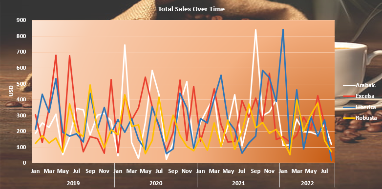
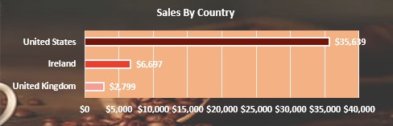
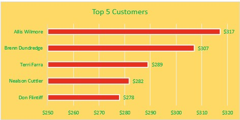
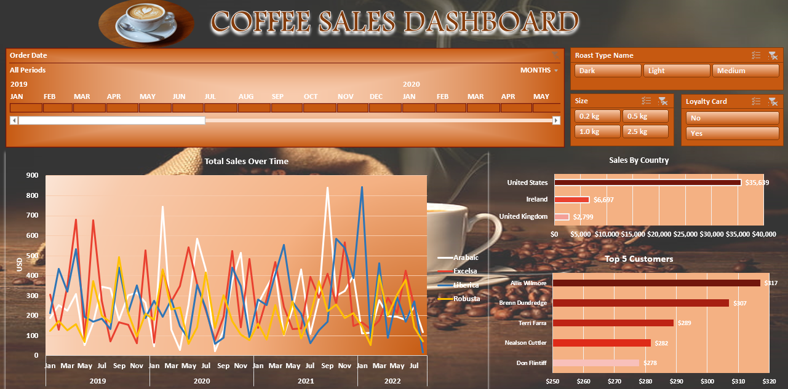

# Coffee-Sales-Dashboard

## Table of Contents

- [Project Overview](#project-overview)
- [Data Sources](#data-sources)
- [Recommendations](#recommendations)

### Project Overview
---

The Coffee Sales Data Analysis Project aims to provide insights into the sales performance of a coffee company spanning from 2019 to 2022. By analyzing various aspects of the sales data, our objective is to identify trends, make data-driven recommendations, and gain a deeper understanding of the company's performance.

### Data Sources

Sales Data: The primary dataset used for this analysis is the "Coffee_Orders_Data" csv file, containing detailed information about customers, products and sales of the company.
[Click here for dataset ](https://github.com/Hari-in-github/Coffee-Sales-Dashboard/blob/main/Coffee_Orders_Data.xlsx)

### Tools

- Excel - Data Cleaning, Analtyis and Dashboard/Report.
  - [Download here](https://microsoft.com)

### Data Cleaning/Preparation

In the initial data preparation phase, we performed the following tasks:
1. Data loading and inspection.
2. Handling missing values.
3. Data cleaning and formatting.

### Exploratory Data Analysis

EDA involved exploring the sales data to answer key questions, such as:

- What is the overall sales trend over the years?
- Which products are top sellers?
- What are the peak sales periods?
- Which countries give most of the sales?

### Box Plots Of various analysis

#### Total Sales Over Time

#### Sales By Country

#### Top 5 Customers

### Excel Dashboard

[Click to download dashboard](https://github.com/Hari-in-github/Coffee-Sales-Dashboard/blob/main/Coffee_Dashboard.xlsx)

### Conclusions
- The dashboard effectively captures the sales trends of the coffee company from 2019 to 2022.
- Analysis of total sales over time indicates a consistent upward trend in revenue until 2021, with a notable decline in sales in 2022.
- The timeline feature allows for easy visualization and comparison of sales performance across different years.
- Sales by country reveal that the United States is the leading market, and sales have drastically fallen across all countries from 2021 to 2022.
- Top 5 customers analysis identifies key clients contributing significantly to the company's revenue, with Allis Wilmore emerging as the top buyer.

